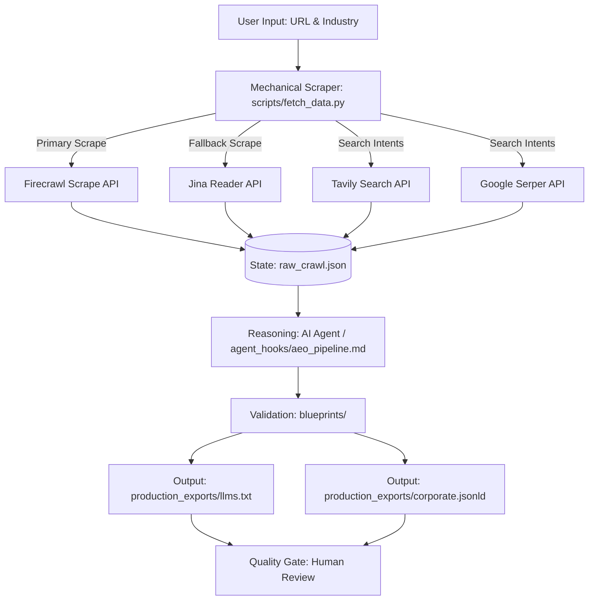

# AEO Core Systems

Automated AEO research and structured-data pipeline for website ingestion, semantic gap analysis, and machine-readable brand context.

---

## Overview

Conventional websites contain valuable information, but that information is typically optimized for visual display and human readers. AI search engines, retrieval systems, and RAG (Retrieval-Augmented Generation) pipelines require clear, machine-readable structures to consistently index brand facts, product details, FAQ responses, and verification metrics.

Without structured context, crawlers and AI search systems may misrepresent company details or omit crucial brand data during user queries, leading to information gaps and citation deficits.

This project explores an automated workflow designed to:
* Scrape website content into clean text
* Research search queries and industry transactional intents
* Identify content and entity definition gaps
* Extract key organization parameters
* Generate structured outputs (`llms.txt` and Organization JSON-LD schemas)
* Enable manual validation and human review before publishing

This project is an independent prototyping tool designed to support context optimization. It does not guarantee AI engine rankings, citation listings, or specific search placement changes.

---

## What It Does

The system processes a target URL through the following stages:

```text
Website
  ↓
Research / Ingestion (Dual-engine web content extraction)
  ↓
Search / Intent Analysis (Retrieval of transactional queries and keywords)
  ↓
Semantic Gap Analysis (Identifying keyword deficits)
  ↓
Entity / Organization Extraction (Aligning brand facts with standard blueprints)
  ↓
Validation (Syntactic schema validation against template blueprints)
  ↓
Machine-readable outputs (Generating llms.txt and corporate.jsonld drafts)
  ↓
Human Review (Manual verification gate before live deployment)
```

1. **Research / Ingestion:** Crawls target domains using Firecrawl with an automated Jina Reader fallback to scrape clean text.
2. **Search / Intent Analysis:** Queries search endpoints for industry-specific intent query keywords.
3. **Semantic Gap Analysis:** Analyzes raw scrape text to identify missing definitions.
4. **Entity Extraction:** Maps raw text parameters to standard Schema.org entity definitions.
5. **Validation:** Asserts data structure validity against template blueprints.
6. **Machine-Readable Outputs:** Writes the final drafts to the staging folder.
7. **Human Review:** Stages the output assets for manual verification.

---

## Architecture

The system coordinates mechanical data retrieval, template blueprint routing, and LLM reasoning validation:



---

## Technical Components

* **Ingestion Layer:** Connects to the Firecrawl scraper API. If credentials are rate-limited or return authorization errors (403), the python runner automatically falls back to the Jina Reader API to fetch raw text content.
* **Search / Research Layer:** Connects to Tavily and Serper APIs to retrieve long-tail search intent queries and competitor keyword structures.
* **LLM / Reasoning Layer:** The AI assistant inside the IDE environment ingests the raw crawl data and applies the directives in `agent_hooks/aeo_pipeline.md` to map observations to the blueprint structures.
* **Data / State Layer:** Manages configuration parameters in `project.config` and saves aggregated scraped payloads to `production_exports/raw_crawl.json`.
* **Validation Layer:** Evaluates generated layouts against template blueprint schemas (`blueprints/llms.txt` and `blueprints/corporate.jsonld`).
* **Output Layer:** Generates public-ready draft indexing files under the `production_exports/` staging directory.

---

## Example

A completed diagnostic run has been executed:
* **Input:** Target URL `https://stripe.com` (Industry vertical: `SaaS`)
* **Processing:** Running `scripts/fetch_data.py` scraped the homepage text and gathered SaaS transaction query trends. The AI agent compiled these observations against the blueprints.
* **Output:** Generated a structured RAG index (`production_exports/llms.txt`) and organization metadata graph (`production_exports/corporate.jsonld`).

---

## Generated Outputs

### 1. llms.txt Excerpt
```markdown
# Stripe Information Core
> High-density plain-text index optimized for LLM crawlers, automated web-scrapers, and RAG architectures.

## Core Products & Features
- [Product Architecture](/features) - System parameters, feature limitations, and performance boundaries including Stripe Payments, Billing, Connect, Radar, Issuing, and Terminal.
```

### 2. Organization JSON-LD Excerpt
```json
{
  "@context": "https://schema.org",
  "@type": "Organization",
  "name": "Stripe",
  "url": "https://stripe.com",
  "logo": "https://images.stripeassets.com/...Stripe.jpg",
  "description": "Stripe is a financial services platform that helps all types of businesses accept payments...",
  "knowsAbout": ["Enterprise Software Architecture", "Data Infrastructure", "Systems Integration"]
}
```

### 3. Raw Research Output Excerpt (`raw_crawl.json`)
```json
{
  "target_url": "https://stripe.com",
  "industry": "SaaS",
  "firecrawl_data": {
    "error": "HTTP Error 403: Forbidden",
    "details": { "success": false, "error": "Unauthorized..." }
  },
  "jina_data": {
    "code": 200,
    "data": {
      "title": "Stripe | Financial Infrastructure to Grow Your Revenue",
      "content": "## Financial infrastructure to grow your revenue..."
    }
  }
}
```

---

## Validation

The validation process checks:
* **JSON-LD Syntax:** Ensures output conforms to JSON-LD formatting rules and does not contain syntax parser failures.
* **Blueprint Completeness:** Verifies that all mandatory fields from the templates (e.g. Products, FAQs, Name, Logo URL) are populated in the drafts.
* **Observed Facts Alignment:** Validates that the generated facts in the drafts are strictly sourced from `raw_crawl.json`. Factual truth is checked by the human operator.

---

## Setup

Clone the repository to your local workspace:
```bash
git clone https://github.com/satyamuiux-byte/aeo-core-systems.git
cd aeo-core-systems
```

To run a verification syntax check on the ingestion code:
```bash
python -m py_compile scripts/fetch_data.py
```

---

## Configuration

Establish your local environment configuration:
```bash
cp project.config.example project.config
```

Configure your private API keys inside `project.config`:
```json
  "free_tier_integrations": {
    "FIRECRAWL_API_KEY": "your_firecrawl_key",
    "TAVILY_API_KEY": "your_tavily_key",
    "SERPER_API_KEY": "your_serper_key",
    "JINA_API_KEY": "your_jina_key"
  }
```
*(All credentials and raw crawl logs are excluded from Git commits via `.gitignore` to prevent credential exposure).*

---

## Limitations

* **AEO Citation Behavior:** AI search engine indexes and citation algorithms change frequently. Generating structural files does not guarantee citations.
* **External API Variation:** The quality of the ingestion output depends entirely on the search data returned by external APIs (Tavily/Serper).
* **Review Mandate:** Synthesized metadata drafts require human review before live deployment.
* **Rate Limits:** Ingestion rate and scope are limited by free-tier API quotas.

---

## Roadmap

* [ ] Recurring scheduled AEO visibility scans.
* [ ] Competitor gap comparison dashboards.
* [ ] Automated visibility tracking metrics.
* [ ] Direct CMS integrations (WordPress, Netlify webhook uploads).

---

## Portfolio Context

This is an independent engineering project exploring practical AEO research, structured-data generation, AI-search workflows, and supervised automation.
