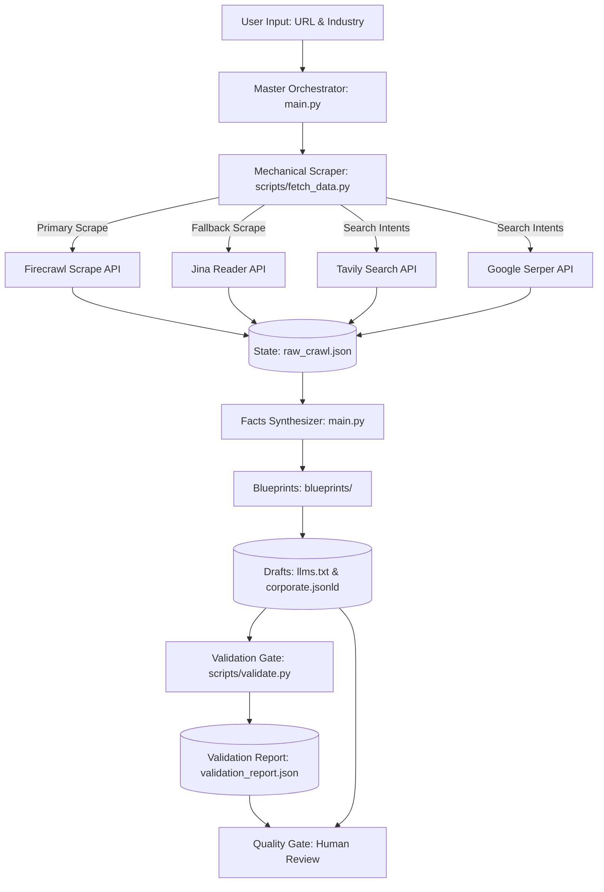

# AEO Core Systems

Automated AEO research and structured-data pipeline for website ingestion, semantic gap analysis, and machine-readable brand context.

---

## Why This Exists

Conventional websites contain valuable information, but that information is typically optimized for visual display and human readers. AI search engines, retrieval systems, and RAG (Retrieval-Augmented Generation) pipelines require clear, machine-readable structures to consistently index brand facts, product details, FAQ responses, and other structured business information.

Without structured context, crawlers and AI-search systems may inconsistently retrieve or represent important company information, creating information gaps in automated retrieval workflows.

---

## What It Does

The system processes a target URL through the following stages:

```text
Website
  ↓
Research / Ingestion (Dual-engine web content extraction with structured failover)
  ↓
Search / Intent Analysis (Retrieval of transactional queries and keywords)
  ↓
Semantic Gap Analysis (Identifying keyword deficits)
  ↓
Entity / Organization Extraction (Aligning brand facts with standard blueprints)
  ↓
Validation Gate (Syntactic and evidence traceability check)
  ↓
Machine-readable outputs (Generating llms.txt and corporate.jsonld drafts)
  ↓
Human Review (Manual verification gate before live deployment)
```

1. **Research / Ingestion:** Crawls target domains using Firecrawl with an automated Jina Reader fallback to scrape clean text.
2. **Search / Intent Analysis:** Queries search endpoints for industry-specific intent query keywords.
3. **Semantic Gap Analysis:** Analyzes raw scrape text to identify missing definitions.
4. **Entity Extraction:** Maps raw text parameters to standard Schema.org entity definitions.
5. **Validation Gate:** Asserts data structure validity and fact traceability against raw data.
6. **Machine-Readable Outputs:** Writes the final drafts to the staging folder.
7. **Human Review:** Stages the output assets for manual verification.

---

## Architecture

The pipeline coordinates mechanical data retrieval, template blueprint routing, LLM reasoning synthesis, and structured validation gates:



---

## End-to-End Workflow

1. **Extraction:** The orchestrator retrieves web pages and search intents via `fetch_data.py`, writing raw facts to `raw_crawl.json`.
2. **Synthesis:** The facts synthesizer extracts key parameters (brand name, description, products, vector logo URLs) and merges them into blueprint schemas, saving drafts under `production_exports/`.
3. **Validation:** The validation gate executes schema, syntax, and traceability verifications, outputting `validation_report.json`.
4. **Handoff:** Telemetry logs and reports are staged for human-in-the-loop validation.

---

## Retrieval & Fallback Strategy

Web scraping endpoints can encounter blocks, rate limits, or network errors. The system uses a failover strategy:
* **Primary Source (Firecrawl Scrape API):** Extracts markdown content with full layout-stripping.
* **Secondary Source (Jina Reader API):** Triggered automatically if Firecrawl returns `403 Forbidden`, rate limits, or timeout errors.
* **Anonymous Failover:** If the Jina authenticated request returns a credential block, the script retries anonymously.
* **Telemetry State Logging:** The status of each retrieval step (attempted, failed, success, HTTP codes) is logged directly into the `telemetry` block of `raw_crawl.json`.

---

## Evidence Model

To ensure reasoning is grounded in evidence rather than AI hallucination, the system differentiates:
* **Observed Facts:** Strings directly supported by crawled texts (mapped to evidence snippets).
* **Inferences:** Suggested content and keyword gap categories derived from competitor search intents.
* **Recommendations:** Proposed action items for structured mapping modifications.

---

## Agent Reasoning

The reasoning hook ([agent_hooks/aeo_pipeline.md](file:///c:/AI%20SEO%20&%20GEO/agent_hooks/aeo_pipeline.md)) provides instructions for local context matching:
* Evaluates keyword relevance and entity representation.
* Flags missing core definitions causing citation deficits.
* Maps extracted brand parameters to JSON-LD Org schemas and RAG-friendly plain-text templates.

---

## Validation Gate

The validation gate ([scripts/validate.py](file:///c:/AI%20SEO%20&%20GEO/scripts/validate.py)) asserts:
* **JSON-LD Validity:** Verifies output schema parses as valid JSON and contains required keys (`@context`, `@type`, `name`, `url`).
* **llms.txt Structure:** Asserts H1 headers and mandatory section layout presence.
* **Fact Traceability:** Matches generated parameters against the raw scraped corpus. Unmatched facts trigger warnings.
* **Structured validation report:** Outputs a schema payload to `validation_report.json`.

---

## Human Review

Human validation acts as the safety gate:
* **Verification of Facts:** Ensures AI-generated context summaries align with actual brand documentation.
* **Schema Verification:** Ensures JSON-LD is syntactically sound before publishing.
* **Controlled Sync:** Deployment of files to production servers requires manual permission.

---

## Generated Outputs

The system writes the following files to `production_exports/`:
1. **`raw_crawl.json`**: Unified crawl dataset and telemetry logs.
2. **`llms.txt`**: Machine-readable text mapping features, products, and links.
3. **`corporate.jsonld`**: Schema.org Organization context block.
4. **`validation_report.json`**: Structured gate telemetry report.

---

## Reproducible Demo

You can run the pipeline with a simulated mock crawl targeting Stripe to see end-to-end execution without requiring active API keys:
```bash
python main.py --url https://stripe.com --industry SaaS --mock
```

This simulates the Jina fallback data and synthesizes outputs directly.

---

## Tech Stack

* **Language:** Python 3 (standard library `urllib` only for native reliability)
* **APIs / Data Extraction:** Firecrawl API, Jina Reader API, Tavily Search, Google Serper
* **Validation & CLI:** Standard libraries (`json`, `re`, `argparse`, `unittest`)

---

## Setup

Clone the repository:
```bash
git clone https://github.com/satyamuiux-byte/aeo-core-systems.git
cd aeo-core-systems
```

Verify compilation:
```bash
python -m py_compile main.py scripts/fetch_data.py scripts/validate.py
```

---

## Running the System

To run a live pipeline audit (requires API keys in `project.config`):
```bash
python main.py --url https://stripe.com --industry SaaS
```

To run a dry-run check of the extraction engine only:
```bash
python scripts/fetch_data.py --url https://stripe.com --industry SaaS
```

---

## Testing

A python test suite covers fallbacks, error handling, validation, and generation:
```bash
python -m unittest discover -s tests
```

---

## Limitations

* **citation impact:** AI search algorithms change over time. Structuring metadata does not guarantee citation rates.
* **API dependency:** Ingestion scope is limited by Tavily/Serper search result structures.
* **Review Mandate:** Draft files require manual review before publishing.

---

## Future Improvements

* [ ] Recurring Cron scans.
* [ ] Competitor gap comparison dashboards.
* [ ] CMS direct uploads.

---

## Portfolio Context

This is an independent engineering project exploring practical AEO research, structured-data generation, AI-search workflows, and supervised automation.
