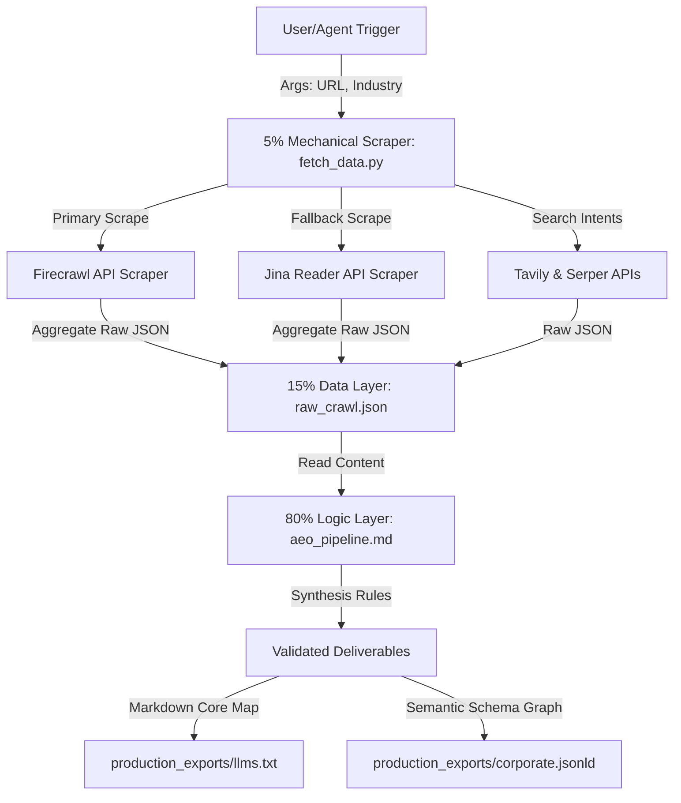

# 🚀 Enterprise AEO (AI Engine Optimization) Data Ingestion & Synthesis Engine

[](https://opensource.org/licenses/MIT)
[](https://python.org)
[](https://schema.org)
[](https://github.com/satyamuiux-byte/aeo-core-systems)

An automated, deterministic pipeline designed to optimize brand presence, citation probability, and information recall within LLM search engines (Perplexity, ChatGPT Search, Gemini, Claude, and RAG systems).

---

## 🎯 The Business Problem: AI Citation Deficit

AI crawlers scrape websites but often fail to extract critical facts (pricing, limits, compliance, customer verification metrics) because standard HTML layouts are messy, non-semantic, and optimized for humans rather than machine parsing. This leads to **citation deficits** when LLM search engines answer transactional queries.

**This engine solves that deficit** by extracting web assets, conducting semantic gap analysis, and exporting machine-readable crawler maps (`llms.txt`) and validated schema graphs (`corporate.jsonld`).

---

## 🛡️ The Intelligence Amplifier Philosophy

This system is built under the core philosophy of **supervised agentic execution** and **Human-in-the-Loop (HITL)** governance:
* **Empowering Team Strategy:** We do not replace human strategic thinking (Marketing leads, SEO managers, and operators control direction).
* **Supervised Automation:** AI handles repetitive ingestion, parsing, and formatting tasks, freeing teams to focus on strategic positioning.
* **HITL Quality Control:** All outputs (`llms.txt` and `corporate.jsonld`) pass through a structured review gate before deployment to ensure brand accuracy, quality, and consistency.

---

## 🏗️ System Architecture: The 80/15/5 Pattern

Built according to elite agentic system architecture patterns to ensure zero runtime code crashes, low API cost boundaries, and strict logical control:



### 1. 80% Markdown (Rules & Logic)
- **Directory:** `/agent_hooks/aeo_pipeline.md`
- **Role:** Directs entity extraction, Princeton KDD guidelines verification, keyword gap evaluation, and output generation logic.

### 2. 15% JSON (Data Storage)
- **Directory:** `/project.config` & `raw_crawl.json`
- **Role:** Manages credentials, routing configurations, and structured raw search metrics.

### 3. 5% Mechanical Arms (Scrapers)
- **Directory:** `/scripts/fetch_data.py`
- **Role:** Pure Python standard library script. Runs API requests without handling decision routing or generating layouts.

---

## 🧠 Algorithmic Execution Loop

```text
Phase 1: Ingestion
  ├── Try Scrape: Firecrawl (https://api.firecrawl.dev/v1/scrape)
  └── Fail/Unauthorized ──> Try Scrape: Jina Reader (https://r.jina.ai/)
        └── Fail/403 ──> Retry Scrape: Jina Reader (Anonymous Fallback)

Phase 2: Intent Mapping & Gap Analysis
  ├── Tavily: Scrape high-intent queries matching target industry vertical
  └── Serper: Identify competitor keyword ranking gaps in LLM answers
  
Phase 3: Metadata Synthesis (Agent-Driven)
  ├── Build llms.txt: Extract products, pricing tiers, and trust structures
  └── Build JSON-LD: Structure organizational metadata context (Schema.org)
```

---

## 🛠️ Operations Manual

### 1. Installation & Environment Configuration
Clone this repository and create a `project.config` at the root using the template in `project.config.example`:

```bash
cp project.config.example project.config
```

Configure your API integrations:
```json
{
  "free_tier_integrations": {
    "FIRECRAWL_API_KEY": "YOUR_FIRECRAWL_KEY",
    "TAVILY_API_KEY": "YOUR_TAVILY_KEY",
    "SERPER_API_KEY": "YOUR_SERPER_KEY",
    "JINA_API_KEY": "YOUR_JINA_KEY"
  }
}
```

### 2. Running Ingestion (Mechanical Arm)
Run the script specifying the company site and the target industry vertical:

```bash
python scripts/fetch_data.py --url https://stripe.com --industry "SaaS"
```

The script will query all target endpoints, automatically resolve security blocks or key rate limits via Jina fallback routing, and save the dataset to `production_exports/raw_crawl.json`.

### 3. Review Output Assets
The agent will ingest the results and produce the public-facing indexes:
- **`production_exports/llms.txt`**: Plain-text RAG index optimized for LLM crawler mapping.
- **`production_exports/corporate.jsonld`**: Schema.org compliant organization block.

---

## 📈 Portfolio Showcase (Case Study)

### Stripe Diagnostic Run Metrics
* **Crawled Domain:** `https://stripe.com`
* **Industry Sector:** `SaaS / Fintech`
* **Identified Keyword Intent Gaps:** "AI-powered billing, dynamic card issuance pricing, fraud-prevention radar rules"
* **Generated Crawler Index:** [llms.txt](production_exports/llms.txt)
* **Generated Schema Graph:** [corporate.jsonld](production_exports/corporate.jsonld)
