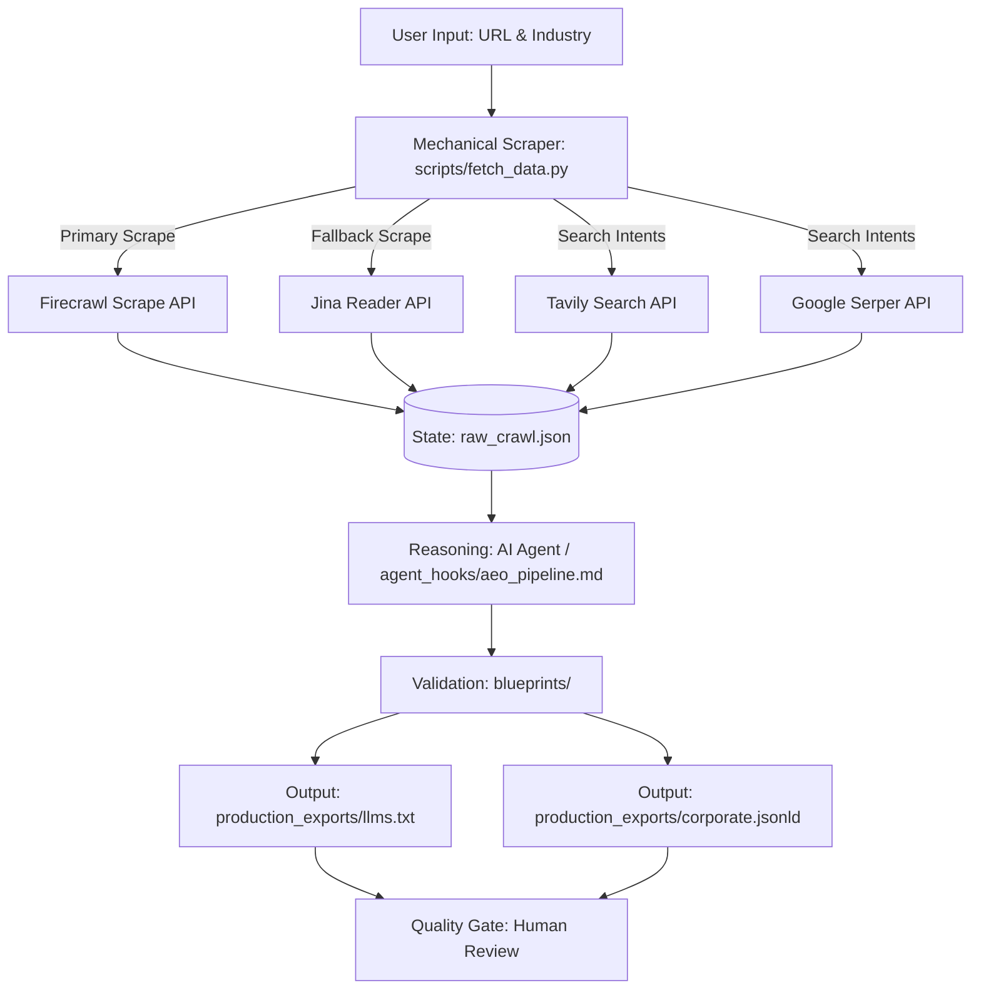

# AEO Core Systems

An automated AEO / AI-search intelligence pipeline for turning website content into structured, machine-readable brand context.

---

## 📋 Portfolio Snapshot

* **Problem:** AI search systems and RAG engines can struggle to consistently extract and retrieve correct brand, product, and compliance facts from conventional, non-semantic website HTML.
* **Solution Built:** A supervised data pipeline that ingests domain content, queries search-intent gaps, and generates structured, machine-readable assets.
* **Outputs:** 
  * `llms.txt` (RAG-friendly crawler index)
  * Organization JSON-LD (Schema.org compliant context graph)
  * Structured raw search results (`raw_crawl.json`)
* **Engineering Focus:** API orchestration, Jina/Firecrawl fallback routing, schema validation, and human-in-the-loop quality controls.

---

## 🎯 The Problem

Conventional website content is structured and designed primarily for human readers. AI search engines and retrieval systems (such as Perplexity, ChatGPT Search, and Gemini) require clear, structured, and easily indexable data. Important details like product limitations, pricing structures, and trust metrics can be difficult for crawlers to parse consistently from HTML markup.

This project implements an automated workflow to explore:
* Programmatic website ingestion
* Search-intent discovery
* Semantic gap analysis
* Structured entity extraction
* Machine-readable format generation (`llms.txt` and JSON-LD)
* Human review of draft metadata before live server deployment

*Note: Generating these files does not guarantee citations or search placement. This project focuses strictly on building the diagnostic and metadata-generation tooling.*

---

## 🧭 What It Does

The system executes a multi-stage pipeline:

```text
Website 
  → Crawl / Ingestion (Markdown extraction via Jina or Firecrawl)
  → Search-Intent Research (Transactional query extraction via Tavily)
  → Semantic Gap Analysis (Identifying missing brand definitions via Serper)
  → Entity / Organization Extraction (Aligning schema inputs with scraped facts)
  → Validation (Formatting outputs against blueprint templates)
  → llms.txt & Organization JSON-LD (Draft generation)
  → Human Review (Manual quality control before live web server sync)
```

1. **Crawl / Ingestion:** Scrapes target domain content and strips out layout noise, formatting the text as clean Markdown.
2. **Search-Intent Research:** Collects top long-tail transactional queries for the specified industry vertical.
3. **Semantic Gap Analysis:** Flags keyword deficits and missing semantic definitions.
4. **Entity Extraction:** Matches scraped organization parameters with Schema.org standards.
5. **Draft Generation:** Writes the structured `llms.txt` index and JSON-LD metadata blocks.
6. **Human Review:** Places files in a staging folder for the operator to approve.

---

## 💡 Why It Matters

Implementing this technical workflow helps streamline content optimizations:
* **Faster Technical Audits:** Automates content ingestion and search intent extraction.
* **Consistent Fact Mapping:** Ensures company facts, products, and case studies are mapped systematically.
* **Machine-Readable Context:** Bypasses visual noise by presenting crawlers with raw, high-density structured metadata.
* **Repeatable Auditing:** Standardizes the diagnostic steps across different client URLs.
* **Human-Controlled Deployment:** Ensures no AI-generated metadata is pushed to production without review.

---

## 🏗️ Architecture

The pipeline separates data retrieval (mechanical arm) from logic processing (AI reasoning agent) and template structure:



---

## 🛠️ Tech Stack

* **Language:** Python 3 (using standard library `urllib` only to avoid external dependency issues)
* **Search / Web Ingestion:** Firecrawl API, Jina Reader API, Tavily Search API, Google Serper API
* **Reasoning / Logic:** Google Antigravity IDE AI Agent (using context hooks to guide templates generation)
* **Data Formats:** JSON, JSON-LD (Schema.org Organization), Markdown (`llms.txt`)
* **Validation:** Blueprint schemas matching standard Schema.org keys

---

## 🚀 Reproducibility

### 1. Configuration
Copy the configuration template to establish your local runtime parameters:
```bash
cp project.config.example project.config
```
Open `project.config` and add your API credentials:
```json
  "free_tier_integrations": {
    "FIRECRAWL_API_KEY": "your_firecrawl_key",
    "TAVILY_API_KEY": "your_tavily_key",
    "SERPER_API_KEY": "your_serper_key",
    "JINA_API_KEY": "your_jina_key"
  }
```

### 2. Ingestion
Run the mechanical ingestion script to extract domain content and search queries. Pass your target URL and industry parameters:
```bash
python scripts/fetch_data.py --url https://stripe.com --industry "SaaS"
```
This script runs the Firecrawl scrape; if the key is unauthorized, it automatically triggers a Jina Reader fallback scrape. Results are compiled inside [production_exports/raw_crawl.json](production_exports/raw_crawl.json).

### 3. Processing & Validation
Load the instructions in [agent_hooks/aeo_pipeline.md](agent_hooks/aeo_pipeline.md) within your IDE environment and direct the agent to read `raw_crawl.json` to map parameters into the blueprint templates inside [blueprints/](blueprints/).

### 4. Reviewing Outputs
Verify the output files generated inside the staging directory:
* **[production_exports/llms.txt](production_exports/llms.txt)**
* **[production_exports/corporate.jsonld](production_exports/corporate.jsonld)**

---

## 📝 Example Run

A completed example run targeting `https://stripe.com` under the `SaaS` industry has been executed:
* **Scraped Ingestion:** Retrieved Stripe homepage data and trust items (Hertz, URBN, Instacart) via Jina Reader fallback.
* **Intent Keywords Ingested:** Tavily and Serper compiled transactional queries such as "SaaS industry transactional intent keywords gap analysis".
* **Generated Outputs:**
  * **Crawler Index (`llms.txt`):** Highlights core products (Stripe Payments, Billing, Terminal) and details on the economic infrastructure problem solved.
  * **JSON-LD Schema (`corporate.jsonld`):** Generated a semantic block matching Organization fields.

---

## 👁️ Human-in-the-Loop Validation

Human review is a mandatory quality and safety layer in the pipeline. It is required to:
* **Ensure Fact Accuracy:** AI agents can miss company-specific nuances; an operator must review and confirm details.
* **Syntactic Verification:** Verify JSON-LD complies exactly with Schema.org standards to avoid search console errors.
* **Controlled Sync:** Ensure no file is deployed to the client website server root without manual validation.

---

## ⚠️ Limitations

* **No Citation Guarantees:** AEO is experimental. Synthesizing structured files does not guarantee that AI search engines will cite or rank the domain.
* **Search Engine Behavior:** AI search algorithms, index rates, and crawler rules change frequently.
* **Dependency on Inputs:** The quality of the output files depends entirely on the accuracy of raw API scrape results and target keywords.
* **Manual Steps:** Processing and publishing the files is a supervised process that requires manual verification and server deployment access.
* **API Limitations:** Free-tier rate limits or website bot blocks can result in incomplete ingestion data.

---

## 🗺️ Roadmap (Planned Work)

* [ ] Automated AI citation monitoring tool.
* [ ] Competitor semantic gap comparison dashboards.
* [ ] Automated cron scheduling for weekly audits.
* [ ] Direct CMS integrations (Netlify webhook, WordPress file sync).

---

## 🎓 Portfolio Summary

Built as an independent engineering project to explore practical AEO, AI-search retrieval, structured data generation, and supervised agentic workflows.
